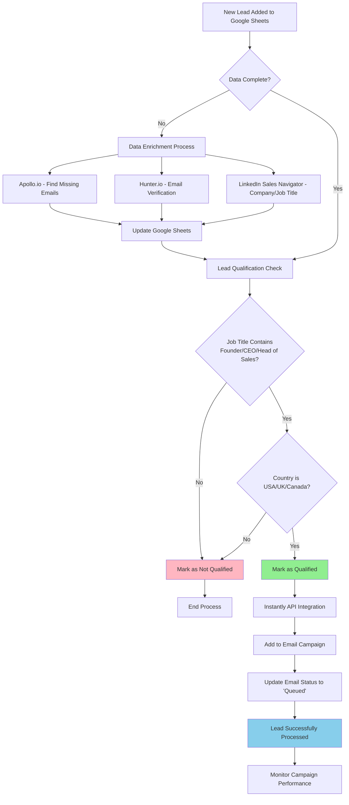

# Lead Qualification and Automation Workflow Assignment

## Target Audience Analysis for Ian Whilby

Based on Ian Whilby's LinkedIn profile, the founders and CXOs most likely to take business or executive coaching from him are:

**Primary Target Audience:**
- **Service-based entrepreneurs** experiencing rapid growth but feeling overwhelmed
- **Executive leaders** in scaling companies who need strategic guidance  
- **Fractional leaders** who want to build with more clarity and consistency
- **Senior executives** at crossroads in their career or business
- **Founders** experiencing burnout while trying to scale
- **CXOs** carrying too much responsibility alone

**Specific Characteristics:**
- High-level operators who know how to push but want sustainable growth
- Leaders facing strategic blind spots or mindset bottlenecks
- Service-based business owners looking to scale without burnout
- Executives seeking clarity, confidence, and consistency
- Leaders at inflection points (growing fast, burning out, or carrying too much alone)

---

## Q1: Tools to Fill Missing Data Fields

**Tools Required:**

1. **Apollo.io** - Primary tool for finding missing email addresses and company information
2. **Hunter.io** - Alternative for email finding and verification
3. **LinkedIn Sales Navigator** - For finding detailed company and job title information
4. **ZoomInfo** - Enterprise-level data enrichment
5. **Google Sheets API** - For automated data updates

**Process:**
1. Export data from Google Sheets to CSV
2. Use Apollo.io bulk email finder to locate missing emails
3. Use LinkedIn Sales Navigator to verify and enrich job titles and company information
4. Use Hunter.io for email verification
5. Import enriched data back to Google Sheets via API

---

## Q2: Automated Lead Qualification System

**Tools Required:**

1. **Zapier** - Primary automation platform
2. **Google Sheets API** - For real-time data access
3. **Make.com (Integromat)** - Alternative automation platform
4. **Google Apps Script** - For custom qualification logic

**Automation Steps:**

1. **Trigger Setup:**
   - Set up Zapier to monitor Google Sheets for new rows
   - Configure webhook to trigger on row addition

2. **Qualification Logic:**
   - Check if Job Title contains: "Founder", "CEO", "Head of Sales"
   - Verify Country is: "USA", "UK", or "Canada"
   - Add qualification status to new column "Qualified"

3. **Implementation:**
   - Use Zapier's Google Sheets integration
   - Set up filter conditions for job titles and countries
   - Automatically mark qualified leads with "YES" in qualification column

---

## Q3: Instantly Integration and Status Updates

**Tools Required:**

1. **Instantly API** - For campaign integration
2. **Zapier** - For workflow automation
3. **Google Sheets API** - For status updates
4. **Webhook integration** - For real-time updates

**Process Steps:**

1. **Qualified Lead Detection:**
   - Zapier detects when a lead is marked as "Qualified = YES"

2. **Instantly Integration:**
   - Use Instantly API to add leads to specific email campaign
   - Send lead data (Name, Email, Company, Job Title, Country, LinkedIn URL)

3. **Status Update:**
   - Update "Email Status" column to "Queued"
   - Add timestamp of when lead was queued
   - Add campaign ID for tracking

4. **Error Handling:**
   - If Instantly API fails, mark status as "Failed"
   - Retry mechanism for failed uploads

---

## Q4: Visual Workflow Diagram



---

## Complete Technical Implementation

### 1. Google Sheets Setup
- Create columns: Name, Company, Email, Job Title, Country, LinkedIn URL, Qualified, Email Status
- Set up data validation for Country field
- Enable Google Sheets API

### 2. Zapier Workflow Configuration
```
Trigger: Google Sheets - New Row
Filter: Check if data is complete
Action 1: Data Enrichment (if needed)
Action 2: Lead Qualification Logic
Action 3: Instantly API Integration
Action 4: Status Update
```

### 3. Qualification Rules
- Job Title must contain: "Founder", "CEO", "Head of Sales" (case-insensitive)
- Country must be: "USA", "UK", "Canada"
- Email must be valid format
- LinkedIn URL must be present

### 4. Error Handling
- Failed API calls are logged
- Retry mechanism for temporary failures
- Manual review queue for edge cases
- Email notifications for system errors

### 5. Monitoring Dashboard
- Real-time qualification statistics
- Campaign performance metrics
- Error rate tracking
- Lead quality scoring

This comprehensive system ensures automated, scalable lead qualification and campaign management for Ian Whilby's coaching business. 